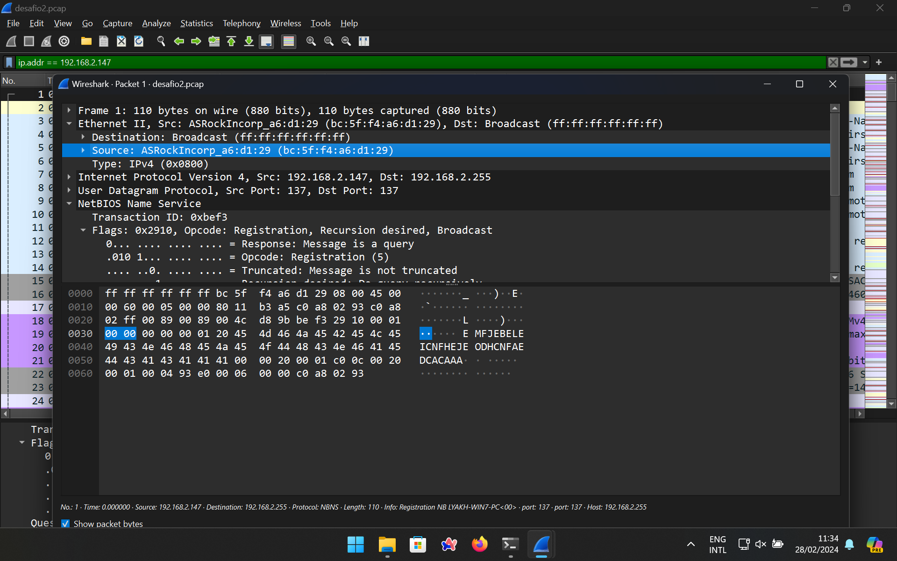
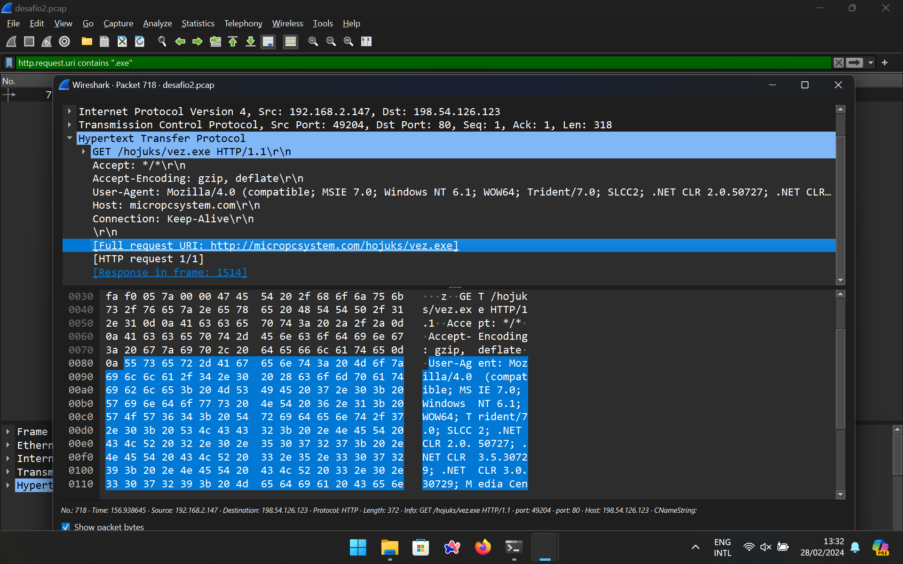
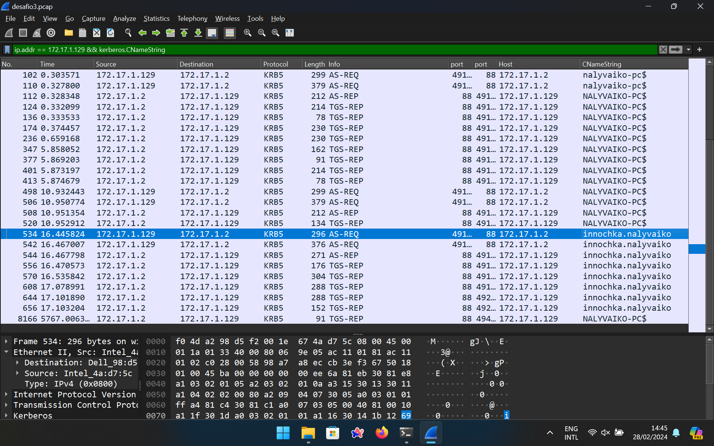
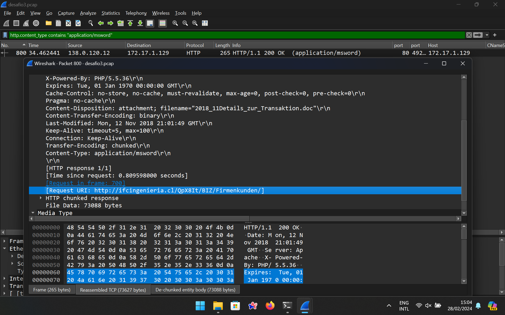
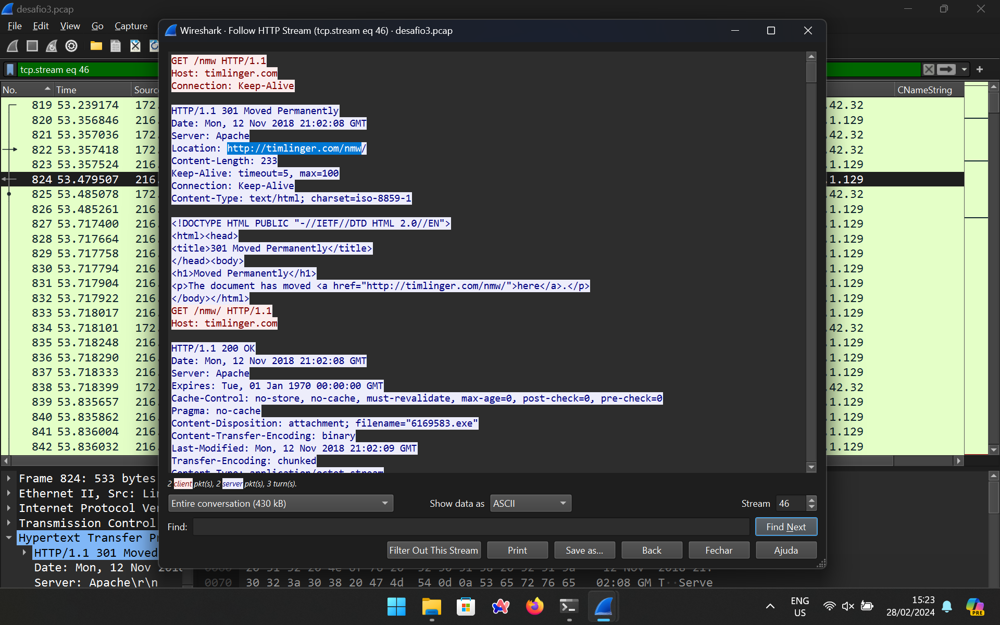

# Roadmap 01 - Analysis on network traffic (Wireshark)

**Author**: Enricco Gemha

**Date**: 02/28/2024

## Question 01

Both Cisco and Trend Micro offer solutions on IDS, as Trend Micro having the most market share.

- [TrendMicro](https://www.trendmicro.com/en_us/ciso/22/l/intrusion-detection-prevention-systems.html)

- [Cisco](https://www.cisco.com/c/pt_br/products/security/ngips/index.html)

## Question 02

While the IDS provides only alerts on possible threats and intrusions, therefore, requiring manual intervention, the IPS also blocks connections that may present suspicious behavior, based on **digital vaccine signatures**. Also, it is possible to configure the IPS with custom parameters to quarantine and block connections.

## Question 03

The DHCP's IP on this network is **10.0.19.14**.

## Question 04

The domain controller (DC) name on this network is **BURNINCANDLE-DC**.

## Question 05
I found two connections that can be classified as potential malicious:

- Connection 1: HTTP GET request to suspicious hostname, **oceriesfornot.top**, which was described in Internet searches as a hostname that hosts malware. Besides that, if we follow the HTTP stream we can observe a request resulting in the download of a text file `Cooper.txt`, which appears to be facade. More than that, it can be related to decripting the zip file that was also downloaded in the same connection.

- Connection 2: HTTPS traffic to file sharing website, which might indicate that an infection occured after the download of such compromised file, in the domain **situla.bitbit.net**.

## Question 06

The MAC address is **bc:5f:f4:a6:d1:29** for the host 192.168.2.4, achieved through inspecting a packet from host, in section ethernet II.

## Question 07

The hostname for the Windows client in 192.168.2.147 is **Lyakh-Win7-PC**. I achieved this through inspecting the DHCP logs, which show the hostname information.

## Question 08

The Windows username used in 192.168.2.147, based on the inspection of the packets with Kerberos protocol, is **jermija**.

## Question 09

Kerberos protocol function is authenticating service requests between two or more trusted hosts across an untrusted network, like the internet. Kerberos employs secret-key cryptography and a trusted third party, the Key Distribution Center (KDC), to authenticate client-server applications and verify user identities. The KDC provides authentication and ticket-granting services, issuing "tickets" for secure identity verification. This process uses shared secret cryptography, protecting against eavesdropping and replay attacks. *[Based on SimpliLearn](https://www.simplilearn.com/what-is-kerberos-article)*.

## Question 10

The URL that returned an executable file is **http://micropcsystem.com/hojuks/vez.exe**.

## Question 11

The URL was accessed in **11/13/2018 02:02:13 GMT**, as shown in this picture with the HTTP stream.

## Question 12

After infection, the host tried to establish a TCP connection with IP **198.54.126.123**.

## Question 13

The MAC address for the Windows client at 172.17.1.129 is **00:1e:67:4a:d7:5c**.

## Question 14

The hostname for the Windows client at 172.17.1.129 is **NALYVAIKO-PC**, as it can be osberved in the CNameString in the TCP request.

## Question 15

The Windows username used in 172.17.1.129, based on the inspection of the packets with Kerberos protocol, is **innochka**.

## Question 16

The URL that returned a Microsoft Word document was **http://ifcingenieria.cl/QpX8It/BIZ/Firmenkunden/**.

## Question 17

The URL was created in **Mon, 12 Nov 2018 21:01:49 GMT**.

## Question 18

The URL that returned an executable *6169583.exe* file is **http://timlinger.com/nmw/**.

