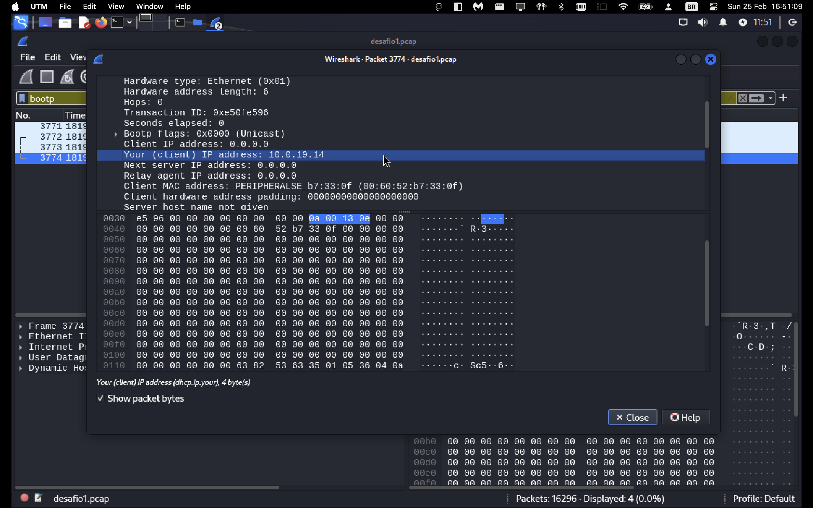
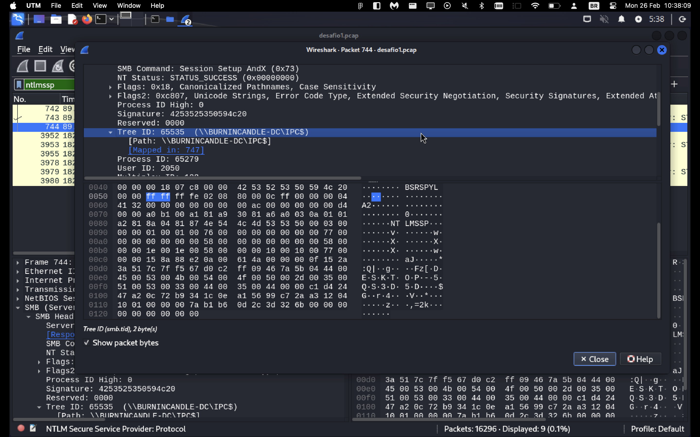
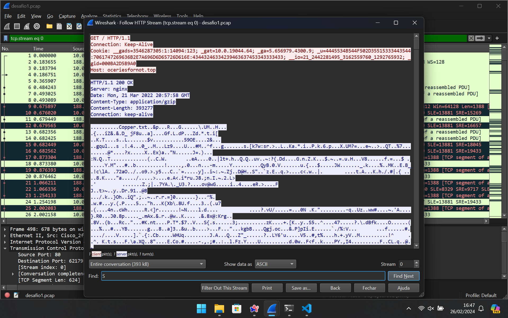
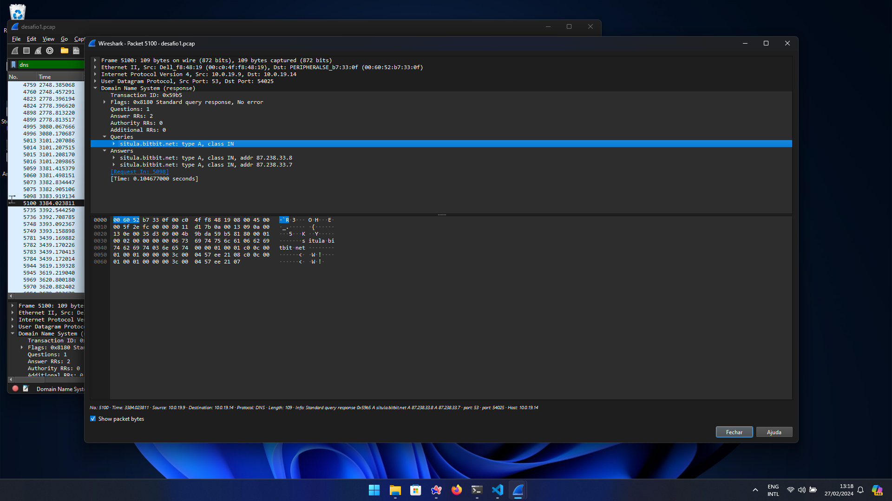

# Roteiro 1 - Análise de tráfego de rede

## Desafio 1 - Malware IceID

### Pergunta 3

O IP do DHCP desta rede é **10.0.19.14**.

### Pergunta 4

O nome do controlador de domínio (DC) desta rede é **BURNINCANDLE-DC**.

### Pergunta 5
Encontrei duas conexões que podem ser classificados como potencialmente maliciosas:

- Conexão 1: GET request em HTTP para um hostname suspeito, *oceriesfornot.top*, que foi descrito em pesquisas na Internet como um hostname que hospeda malware. Além disso, se seguirmos a HTTP stream podemos observar que a requisição resulta em um download de um arquivo texto `Cooper.txt`, que aparenta ser somente uma fachada. Mais que isso, ele pode estar relacionado ao decripting do zip file que também foi baixado nesta mesma conexão.

- Conexão 2: Tráfego HTTPS para site de compartilhamento de arquivos, que pode indicar que a infecção ocorreu após o download de um arquivo comprometido, no domínio `situla.bitbit.net`.

