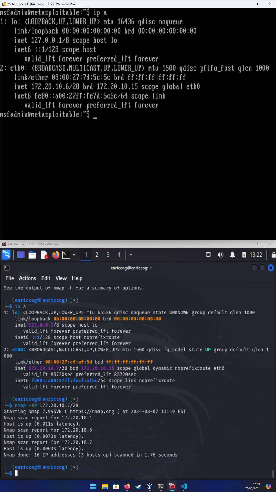
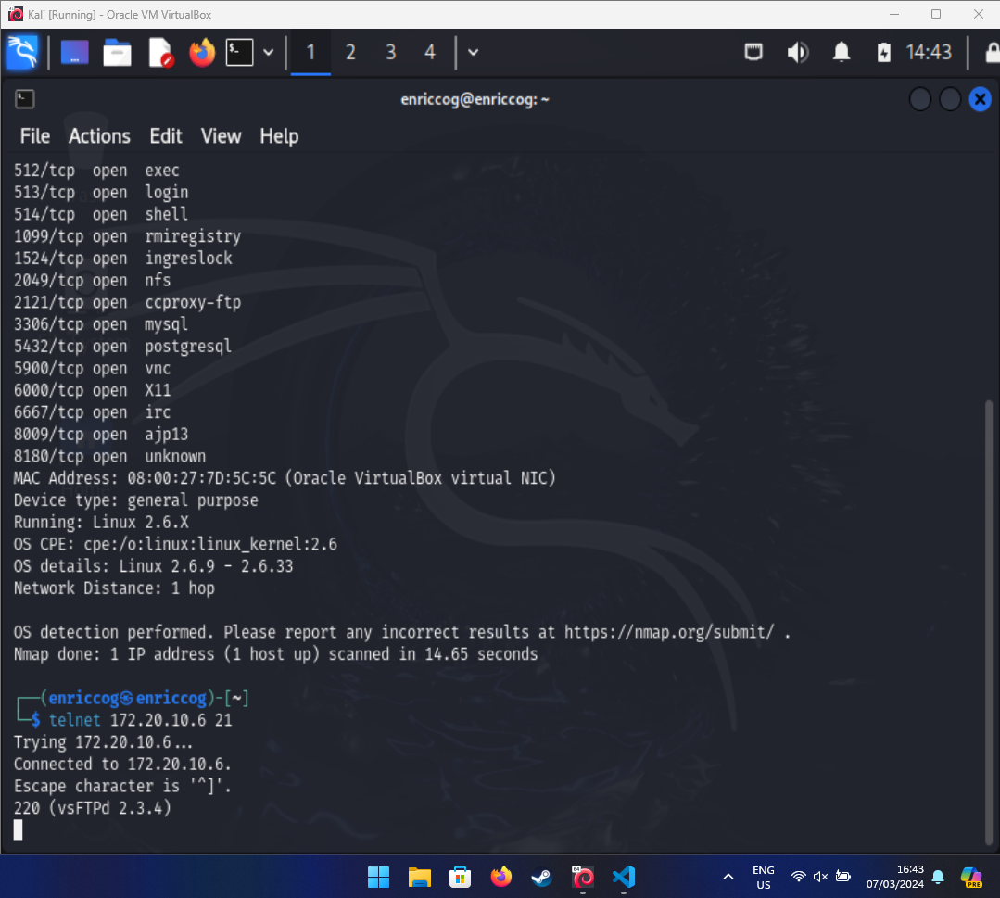
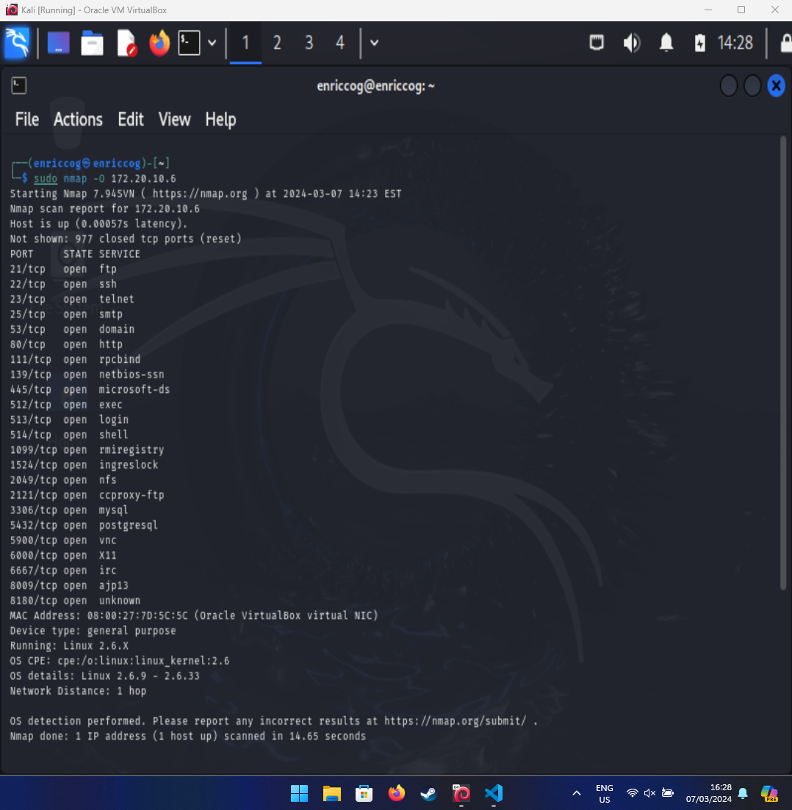
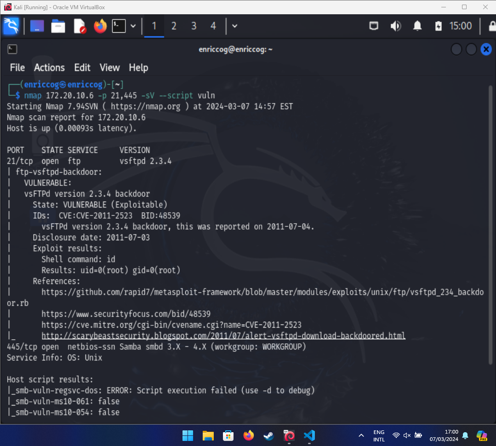
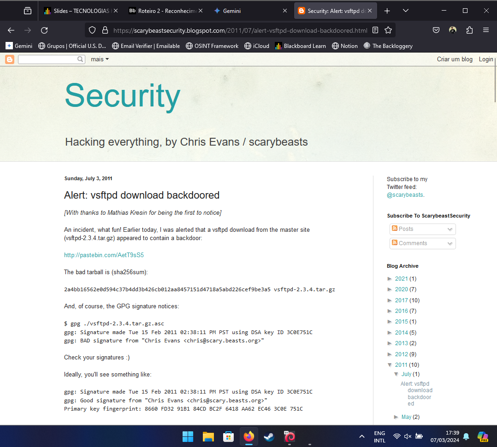
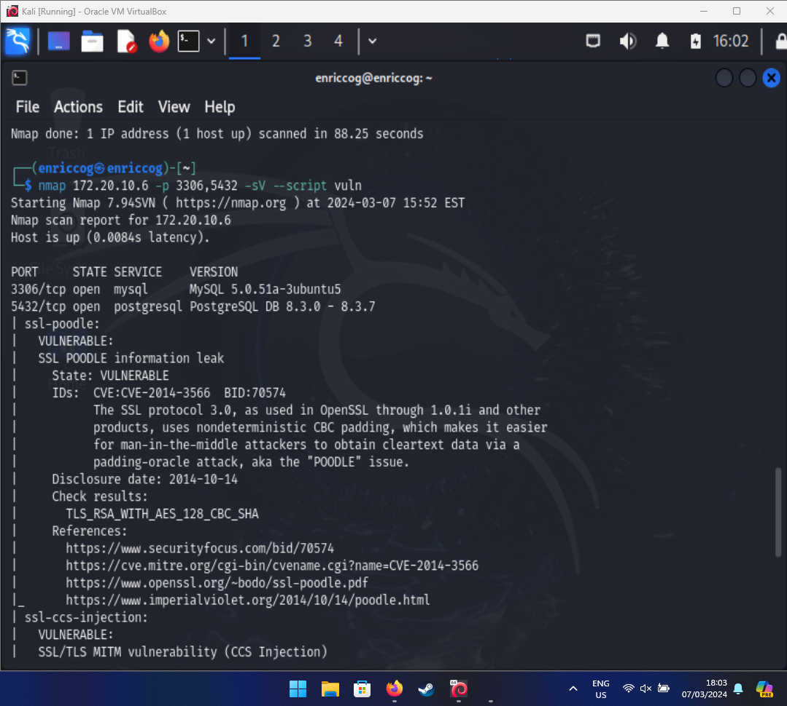
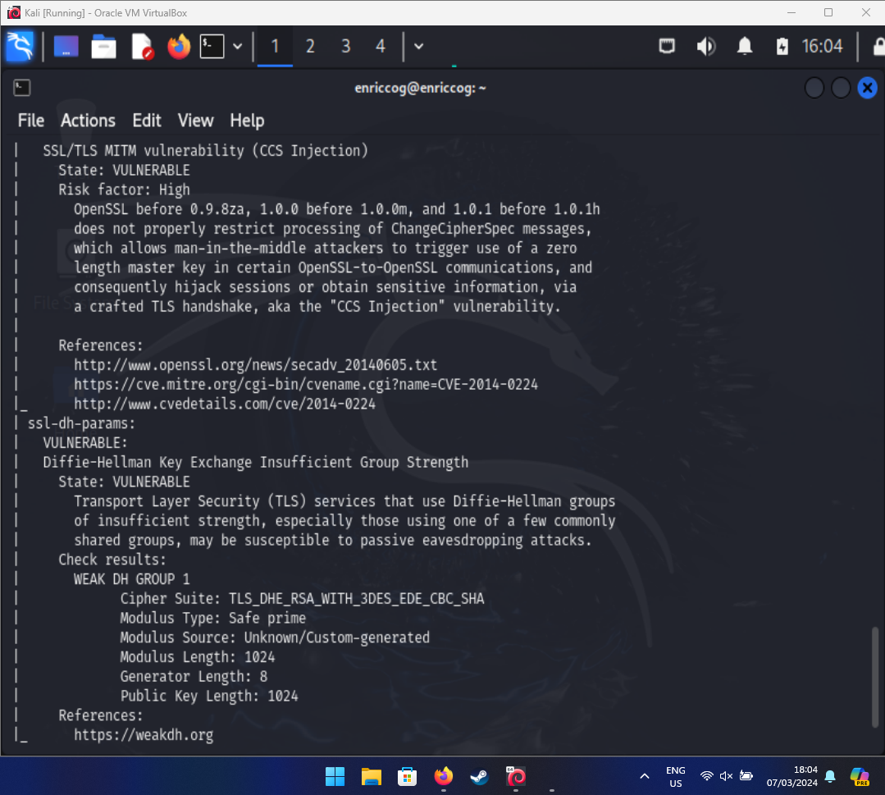
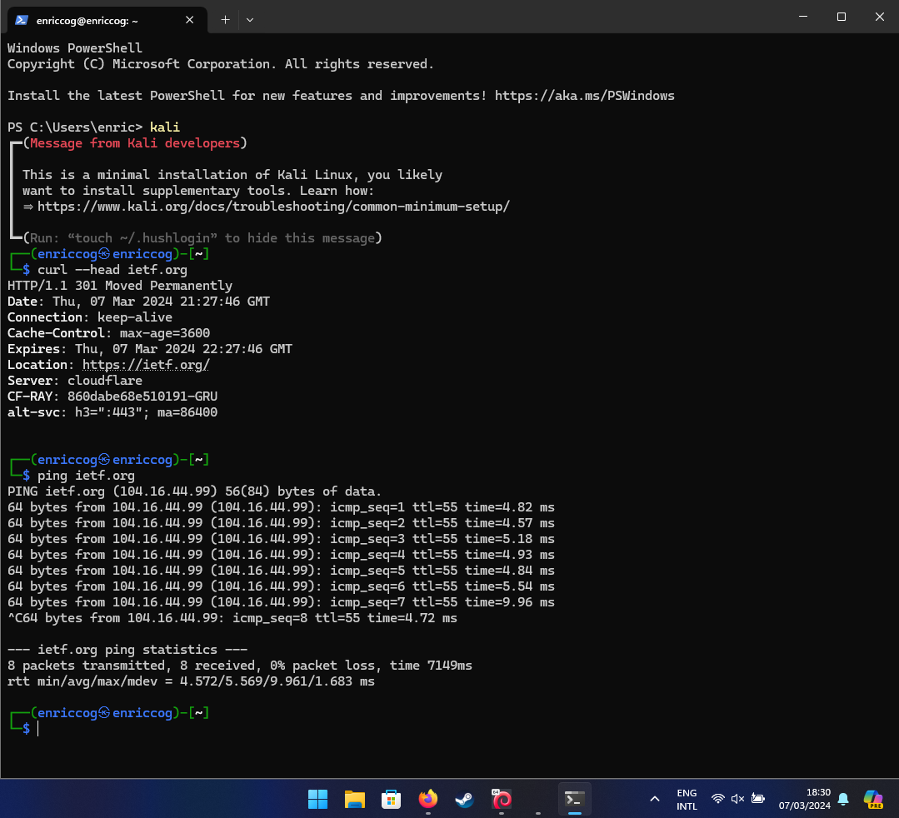
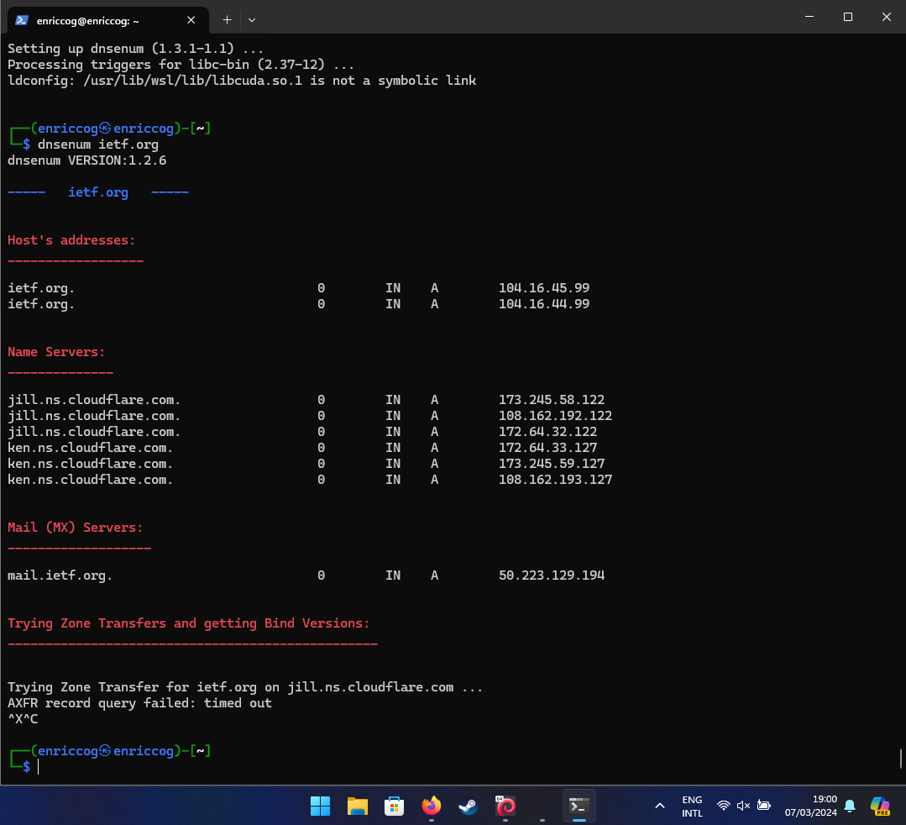
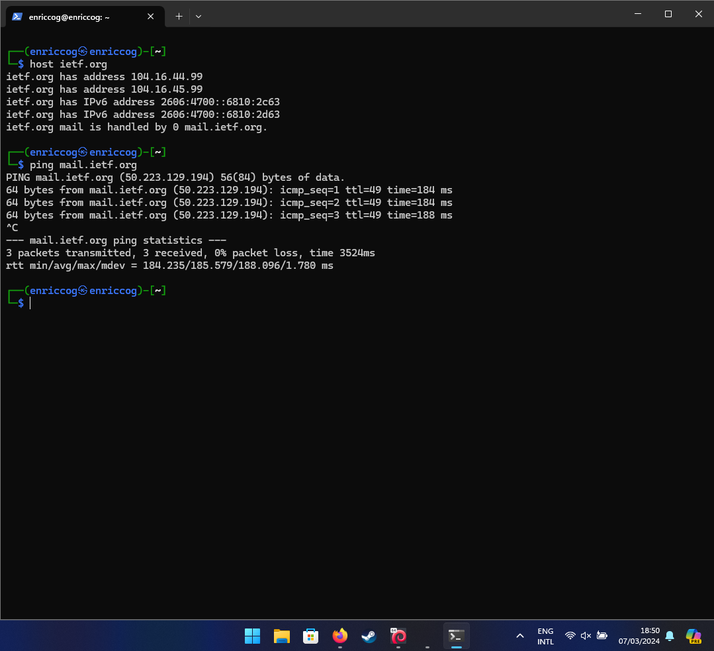

# Roadmap 02 - Exploration on vulnerable environments

**Author**: Enricco Gemha

**Date**: 03/07/2024

## Task 01 - Target inspection

### Discover the target machine IP

After booting up both machines, Kali (source) and MetaExploitable2 (target), on the same network (bridged connection), I executed an `ip a` on source machine, which returned that eth0 has a broadcast of **172.20.10.7/28**. Therefore, I ran a `nmap -sP 172.20.10.7/28` that did a ping on each of the IPs on this subnet, returning three IPs: **172.20.10.1, 172.20.10.6, and 172.20.10.7**. With a quick thought, we can exclude the IP 172.20.10.1, which is always related to the gateway on a subnet. We can also exclude the 172.20.10.7, because it is the IP that is associated with the source machine (Kali), as seen in the output of `ip a`. This leaves us with the IP **172.20.10.6** for the target (MetaExploitable).

### Exercise A - Scan port 21 on target

In order to learn which program is running on the port 21 in the target machine, I executed a `telnet 172.20.10.6 21` command, which returned a FTP server, vsFTPd, in the version 2.3.4.

### Exercise B - Footprint

Using the command `sudo nmap -O 172.20.10.6` which shows all the open ports for the target. It also shows the MAC address (08:00:27:7D:5C:5C). It is running a Linux 2.6.X.

### Exercise C - List vulnerabilities on port 21 and 445

Using the command `nmap 172.20.10.6 -p 21,445 -sV --script vuln` I am able to learn that port 21 is running FTP and 445 SMBD. It also shows that this version of vsFTPd (2.3.4) is vulnerable to backdoors, as reported in 2011-07-04.

### Exercise D - Discover exploit for aforementioned vulnerability

The following link [ScaryBeastSecurity](https://scarybeastsecurity.blogspot.com/2011/07/alert-vsftpd-download-backdoored.html) suggested by nmap in the previous screenshot, shows a backdoor installed in the redistributable file for vsFTPd.

### Exercise E - Find a high risk CVE on ports 3306 and 5432

Running the command `nmap 172.20.10.6 -p 3306,5432 -sV --script vuln`, we can see three vulnerabilities in the PostgreSQL process. However, there's only one classified as high risk, which is related to the OpenSSL, the [**ssl-ccs-injection**](https://cve.mitre.org/cgi-bin/cvename.cgi?name=CVE-2014-0224).

### Exercise F - Gathering information from [IETF](ietf.org)

- i. What's the associated IP?

  - The IP associated with the name ietf.org is **104.16.44.99**, that is shown when executing `ping ietf.org`. 

- ii. What are its DNS servers?

  - The application uses Cloudflare to manage the DNS. There are two name servers from Cloudflare responding to this domain, **jill.ns.cloudflare.com.** and **ken.ns.cloudflare.com.**, with a total of six IPs associated with these two name servers. 

- iii. Is there any e-mail server associated to this name? What is its name and IP?

  - Yes, there is. The name is **mail.ietf.org** and its IP is **50.223.129.194**. 

### Exercise G - 